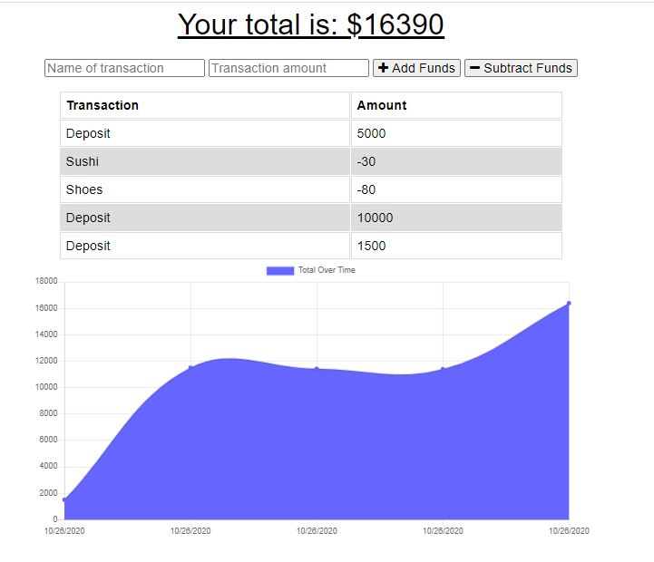

# hw-18-budget-tracker

### Description

This is a budget tracker targeting the money management field by helping you manage your money and prevent overdrafting.

### Deployed Link

**https://budget-app-khall.herokuapp.com/**

### Installation

This app is deployed on Heroku. Once you enter the url, you can enter your credits and debits by inputing the transaction type, amount, and whether to add or subtract that amount.

### Usage

Creating this app involved compression, node.js, mongoose, morgan, express, and the chrome development tools.

### Contributing

Acknowledgements goes to my instructor, TA's , and classmates as well as previous class activites.

### Questions

Questions can be sent to me via Github at:

**https://github.com/hallkr86**

### License

Copyright 2020 - Kesha Hall

Permission is hereby granted, free of charge, to any person obtaining a copy of this software and associated documentation files (the "Software"), to deal in the Software without restriction, including without limitation the rights to use, copy, modify, merge, publish, distribute, sublicense, and/or sell copies of the Software, and to permit persons to whom the Software is furnished to do so, subject to the following conditions:

The above copyright notice and this permission notice shall be included in all copies or substantial portions of the Software.

THE SOFTWARE IS PROVIDED "AS IS", WITHOUT WARRANTY OF ANY KIND, EXPRESS OR IMPLIED, INCLUDING BUT NOT LIMITED TO THE WARRANTIES OF MERCHANTABILITY, FITNESS FOR A PARTICULAR PURPOSE AND NONINFRINGEMENT. IN NO EVENT SHALL THE AUTHORS OR COPYRIGHT HOLDERS BE LIABLE FOR ANY CLAIM, DAMAGES OR OTHER LIABILITY, WHETHER IN AN ACTION OF CONTRACT, TORT OR OTHERWISE, ARISING FROM, OUT OF OR IN CONNECTION WITH THE SOFTWARE OR THE USE OR OTHER DEALINGS IN THE SOFTWARE.
